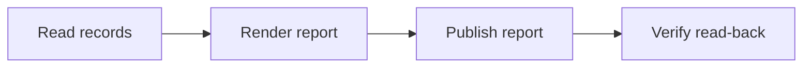
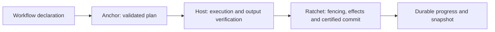

# Anchor Harness

**Deterministic workflow planning and a guided execution plugin for agent workflows.**

Anchor turns a declared workflow into an explicit order of work: what depends on
what, which checks are required, what can be skipped, and what must be repeated
after a change. An agent can choose how to perform a task while the harness makes
the workflow's structure visible and checkable.

> **Status: 0.4.0 — public experimental prerelease.** The new pure planning
> library is opt-in and requires Python 3.11+. The original YAML workflow helper
> and plugin remain available. MIT license. See [validation](docs/VALIDATION.md)
> and [current boundaries](#current-boundaries).

[Quick start](#quick-start-pure-planning) · [Choose a path](#two-ways-to-use-anchor) ·
[Incremental work](#incremental-planning-and-selective-resume) ·
[Plugin setup](#use-the-original-yaml-helper) · [Ratchet](#how-anchor-and-ratchet-fit-together) ·
[Documentation](#documentation)

## What problem does it solve?

A request such as “refresh and publish this report” contains dependencies that
should survive an agent's changes in approach. Publication needs a valid report;
the report needs collected inputs; an external write needs read-back. A shorter
run mode must not quietly remove a required check.

Anchor gives those relationships a declared form and validates them before work.
For example, the included JSON workflow looks like this:



Its `publish` node names `verify` as a mandatory downstream verifier. A full plan
includes that verifier even though the verifier's own mode list names only `deep`.
This is a structural guarantee about the plan. The host still has to execute the
nodes and verify the results.

## Two ways to use Anchor

| | Pure planning library — new in 0.4.0 | Original YAML helper and plugin |
|---|---|---|
| Entry point | `anchor_harness` or `anchor-plan` | `anchor.py` and the `anchor-orchestrator` skill |
| Workflow format | Strict JSON manifest | YAML frontmatter in Markdown |
| Main purpose | Compile and analyze plans for a host application | Guide an agent through a local workflow |
| Execution | Returns plans and identities; performs no work | Agent performs work; helper controls readiness, recording, verification and gates |
| State | No durable state | Files under the chosen project root |
| Dependencies | Python standard library | Python plus PyYAML |
| Distribution | Installable Python wheel; also bundled in plugin | Plugin ZIP or source checkout |

Use the library when you already own execution, model calls, storage or scheduling.
Use the original helper when you want a local agent workflow with templates,
verification steps and human gates. For a one-off conversation without a reusable
workflow, a harness may add little value.

These are separate schemas and execution paths. Installing the library does not
install an agent-host integration, convert old workflows, migrate run state, or
add transactional fencing to the original helper.

## Quick start: pure planning

Start from the versioned source checkout:

```bash
git clone --branch v0.4.0 https://github.com/pr9868/anchor-harness.git
cd anchor-harness
python3.11 -m venv .venv
source .venv/bin/activate
python -m pip install .
anchor-plan examples/workflow.json --mode full
python examples/planning.py
```

`anchor-plan` prints JSON containing the ordered nodes, skipped-node explanations,
terminal nodes and plan digest. For the included workflow, full mode produces
`read → render → publish → verify`. The second command demonstrates incremental
planning, bounded allocation and selective resume using synthetic inputs.
Neither command calls a model or publishes a report.

Download the wheel, source archive or `anchor.plugin` from the [0.4.0 GitHub prerelease](https://github.com/pr9868/anchor-harness/releases/tag/v0.4.0).
The release includes SHA-256 checksums. This version is distributed through GitHub;
these instructions do not depend on a package-index release.

### Compile from Python

This example runs from the repository root after installation:

```python
import json
from pathlib import Path
from anchor_harness import WorkflowManifest, compile_workflow

value = json.loads(Path("examples/workflow.json").read_text())
plan = compile_workflow(WorkflowManifest.from_dict(value), mode="full")

print([node.node_id for node in plan.nodes])
print(plan.digest)
assert [node.node_id for node in plan.nodes] == ["read", "render", "publish", "verify"]
```

No installation is needed to invoke the bundled compiler directly:

```bash
python skills/anchor-orchestrator/scripts/anchor-plan.py examples/workflow.json --mode full
```

### Understand the manifest

A manifest identifies a workflow and its nodes. Dependencies are explicit;
`consumes` and `produces` additionally describe the artifacts crossing those edges.
Declaring an artifact does not replace declaring its producer as a dependency.

| Field | Purpose |
|---|---|
| `workflow_id`, `version` | Stable identity for the workflow declaration |
| `inputs` | Artifacts available before the workflow starts |
| `nodes[].node_id`, `kind` | Stable node identity and operation category |
| `depends_on` | Nodes that must precede this node |
| `consumes`, `produces` | Artifact requirements and outputs |
| `modes` | Direct selection for `quick`, `full` or `deep` |
| `verification_node_id` | Required downstream verifier for an external effect |
| `entry_node_ids`, `terminal_node_ids` | Optional explicit graph boundaries |

The compiler rejects unknown fields, duplicate node IDs, cycles, missing dependencies,
undeclared consumed artifacts and invalid effect-verification paths. It includes
required dependencies and effect verifiers when selecting a mode. Equivalent node
and dependency declaration order produces the same canonical plan digest.

See the [complete example manifest](examples/workflow.json) and
[planning guide](docs/PLANNING.md) for accepted node kinds and API details.

## Incremental planning and selective resume

Two different events need different planning decisions:

| Event | API | Result |
|---|---|---|
| An input or node changes | `plan_incremental` | Schedule affected descendants and required verifiers; identify reusable inputs |
| A work batch fails or times out | `plan_resume` | Reuse exact sealed responses and identify incomplete batches for another attempt |

### Recompute affected work

Suppose `read → render → publish → verify` has a verified baseline and only the
rendering work changes. The incremental plan can reuse the read result and schedule
`render`, `publish` and `verify`. It does not claim those nodes have executed.

The caller supplies `ReusableOutput` values bound to the exact full-plan digest
and declares whether dependency information is complete. Missing cached inputs
invalidate their descendants. Unknown changed node IDs, missing dependency proof
or a changed baseline plan widen the scope to the complete selected plan.

The host must verify cached bytes and identify all relevant changes. Anchor cannot
discover hidden dependencies or decide whether a cached result remains meaningful.
See [the runnable planning example](examples/planning.py).

### Bound batches and retry incomplete work

`build_cohort_manifest` groups `WorkUnit` values under a `CohortBudget` with limits
for item count, input characters, input tokens and expected duration. A unit that
exceeds a limit is rejected before allocation. Stable stage names keep unlike work
separate; stage-name sorting is allocation order, not permission to execute out of
DAG order. Resource values are estimates, not measured runtime caps.

`allocate_attempt` binds an attempt to its plan, batch allocation, provider-adapter
and runtime-capability digests. `plan_resume` accepts exact `SEALED_VALID` responses
for reuse and returns next attempt numbers for missing or incomplete batches.
Drift, duplicate attempts, conflicting sealed responses and attempts created after
a sealed success are rejected. The host verifies response content before sealing
and persists attempts and results; the library keeps no durable counters.

### Keep related commits together

A work batch limits execution size. A **commit cohort** declares which sources,
outputs and effects must be present together at commit time. These are different
concepts and have separate APIs.

`compile_commit_cohorts` groups source declarations by shared outputs, effects or
dependencies. The default is one combined cohort; `split` separates only independent
connected components. A runtime such as Ratchet evaluates the actual commit evidence.

## Use the original YAML helper

The original plugin contains an agent-facing skill, a deterministic helper,
configuration assets, and five starter workflows: `dashboard-refresh`,
`weekly-report`, `reconcile`, `monitor-alert` and `digest`.

To try the helper directly from the repository root:

```bash
python -m pip install PyYAML
python skills/anchor-orchestrator/scripts/anchor.py --root ./demo-project init --template dashboard-refresh
python skills/anchor-orchestrator/scripts/anchor.py --root ./demo-project validate dashboard-refresh
python skills/anchor-orchestrator/scripts/anchor.py --root ./demo-project plan dashboard-refresh
```

This creates a local example project with a workflow, configuration and a `CLAUDE.md`
contract snippet. Review its source configuration before using it for real work.
To build the installable plugin archive:

```bash
python scripts/build_plugin.py
python scripts/check_plugin.py dist/anchor.plugin
```

Install `dist/anchor.plugin` through a host that supports this plugin format.
The wheel contains the pure planning library; the ZIP contains the agent skill,
legacy helper, templates and bundled compiler. Host-specific installation is separate.

### The original execution loop

1. The agent matches or selects a declared workflow and starts a run.
2. `ready` identifies which nodes may run. The agent performs the work inside a node.
3. `record` places the result in quarantine; `verify` applies the configured check.
4. Blocking before-gates prevent premature recording; blocking after-gates hold verified
   output until approval. Conditional nodes are skipped when their predicate is false.
5. `end` rejects an incomplete run rather than recording success.

Verification can use the helper's metadata DSL or an explicitly recorded judgment
result. Human or agent judgment still depends on the quality of the supplied evidence.
Source reconciliation and map iteration are agent work under the workflow schema;
there are no standalone `merge` or `expand` helper commands in this release.

| Task | Helper command |
|---|---|
| Scaffold a project | `init --template <name>` or `init --all` |
| Check and preview a workflow | `validate <workflow>`, `plan <workflow>` |
| Index and find workflows | `reindex`, `match "<request>"` |
| Begin a run | `start <workflow> --scope full --param key=value` |
| Find runnable nodes | `ready <run_id>` |
| Submit and verify output | `record <run_id> --node <id> --output <path>`, then `verify <run_id> --node <id>` |
| Resolve a gate | `gate <run_id> --node <id> --approve`, `--choose <option>` or `--reject` |
| Inspect or restore state | `status <run_id>`, `list`, `restore <run_id>` |
| Finish or abandon a run | `end <run_id>` or `end <run_id> --abort` |

Use `--help` on the helper or a subcommand for its complete arguments.
The [YAML workflow schema](skills/anchor-orchestrator/references/workflow-schema.md)
and [orchestrator skill](skills/anchor-orchestrator/SKILL.md) describe this execution path.

## How Anchor and Ratchet fit together



Anchor answers which work is required and how it depends on other work.
[Ratchet Runtime](https://github.com/pr9868/ratchet-runtime) supplies optional durable
ownership, effect recovery and commit integrity. The host connects the two.

The packages are independently usable. There is no automatic bridge from the new
planner into Ratchet or the legacy YAML runner. Anchor's planning cohort values must
be converted to runtime values, with planned output IDs mapped to actual verified
artifact digests. See the [integration boundary](docs/PLANNING.md#ratchet-boundary).

## Current boundaries

The pure library performs no source reads, model calls, writes, scheduling, approval
collection or publication. Its output proves planning structure, not execution or
semantic correctness. A `human_gate` in a plan still needs a host implementation.

The original helper provides a local file-based workflow protocol. It does not
inherit SQLite durability, cross-process fencing or distributed execution from the
new library. Neither schema is automatically converted to the other. The historical
[design specification](docs/design-spec.md) includes deferred ideas; this README and
[planning guide](docs/PLANNING.md) describe this version.

## Validate and contribute

```bash
python -m pip install ".[test]" build
python -B -m pytest -q
python scripts/check_release.py
python -m build
python scripts/build_plugin.py
python scripts/check_plugin.py dist/anchor.plugin
```

Local validation recorded **48 passing tests**, covering the original helper,
strict compilation, declaration-order determinism, dependency cohorts, bounded
allocation, incremental fallback and selective resume. Installed-wheel examples
and extracted-plugin checks passed. The Linux/Python 3.11–3.13 [GitHub CI matrix](https://github.com/pr9868/anchor-harness/actions/runs/36664843979)
also passed. See [validation evidence](docs/VALIDATION.md).

For a bug report, identify the library or helper path, provide a small synthetic
manifest and show the expected and actual plan or state transition. Keep private
workflow inputs out of reports. When changing behavior, update the corresponding
schema documentation, tests and changelog; keep the existing execution path usable.

## Documentation

| Read this | For |
|---|---|
| [Planning guide](docs/PLANNING.md) | New APIs, schema, reuse requirements and compatibility |
| [JSON workflow](examples/workflow.json) and [Python example](examples/planning.py) | Working library examples |
| [Orchestrator skill](skills/anchor-orchestrator/SKILL.md) | How an agent drives the original helper |
| [YAML schema](skills/anchor-orchestrator/references/workflow-schema.md) | Legacy workflow fields and verification rules |
| [Dispatcher](skills/anchor-orchestrator/references/dispatcher.md) | Selecting a workflow or handling open-ended work |
| [Design history](docs/design-spec.md) | Original design and deferred functionality |
| [Changelog](CHANGELOG.md) | Version and compatibility changes |
| [Validation](docs/VALIDATION.md) | Local evidence and remaining checks |
| [Source provenance](docs/UPSTREAM-PROVENANCE.json) | Exact extraction lineage |

Licensed under [MIT](LICENSE).
